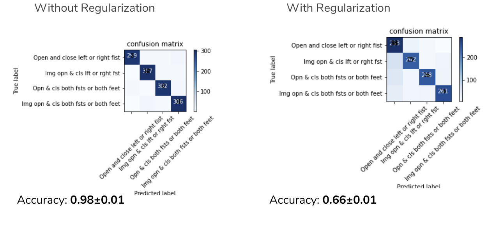
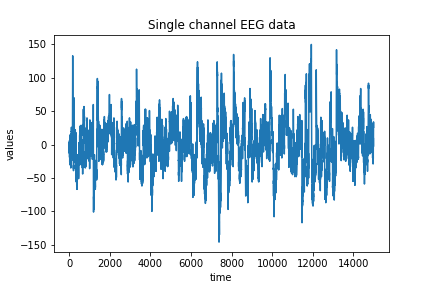
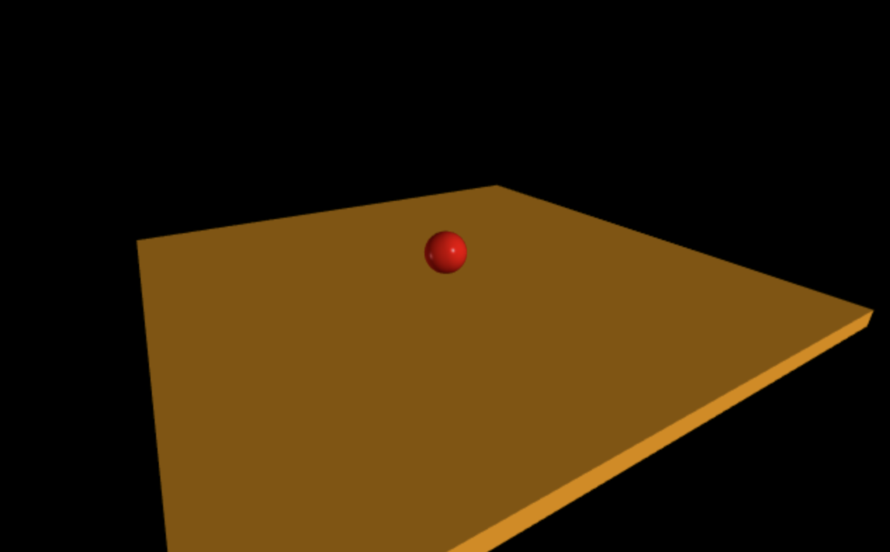

  # The Matrix: Navigating VR with Machine Learning-Decoded EEG’s 
  
  -----
  

  Mawaba Pascal Dao  
  Pdao2015@my.fit.edu  
  Spring 2020   
  

  Brain-Computer Interfaces (BCI) are becoming more and more relevant, as an increasingly digitized society will reward faster data transfer rates between humans and machines. Furthermore, as the technology progresses, the prospect of real-world applications in various areas bears increasing significance. An example of such an area of application is the medical industry, where BCI could help patients suffering from various forms of loss of motor functions. In this paper, we propose the application of a Convolutional Neural Network to decode EEG signals for controlling a mouse cursor on a screen. The application of a CNN to EEG decoding is a relatively novel approach but has shown extremely promising results [1]. CNN’s enable a more accurate classification of EEG signals compared to traditional approaches such as SVM’s while requiring no preprocessing steps, unlike SVM’s. This paper demonstrates the classification accuracy of a CNN model applied to time series EEG training data.   

 -----

 References 
  

  
[1] Aznan, Nik Khadijah Nik, et al. “On the Classification of SSVEP-Based Dry-EEG Signals via Convolutional Neural Networks.” 2018 IEEE International Conference on Systems, Man, and Cybernetics (SMC), 2018, doi:10.1109/smc.2018.00631. 

 -----
 # Results

 -----
 # Single channel raw EEG

 -----
 # Virtual navigation
The predictions on the EEG signals are used to move a ball in a virtual environment.
In theory, subjects whose signals were used to train the model could put on an EEG headset and control the ball 
in real time with their raw brain brain activity without any preprocessing required.

